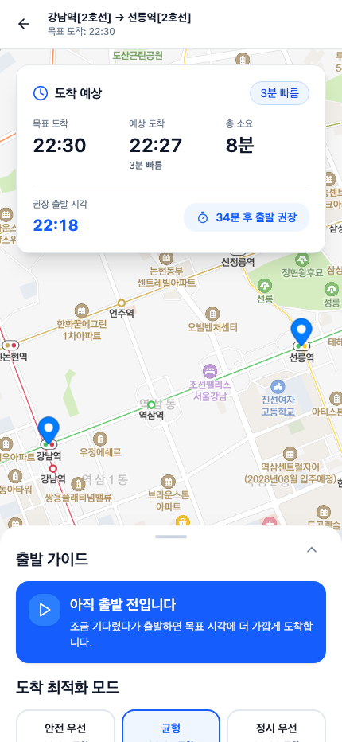
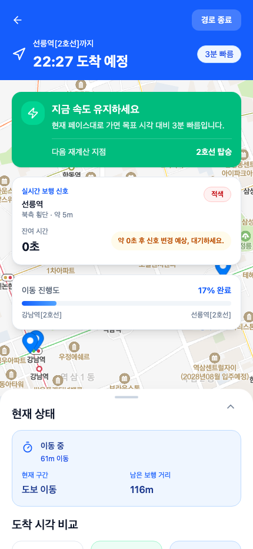

# BBARU

> 목표 도착 시각에 가장 가깝게 도착하도록 돕는 초개인화 ETA 서비스

**Live Demo: [bbaru.vercel.app](https://bbaru.vercel.app)**

기존 지도 앱은 "지금 출발하면 언제 도착하는지"를 알려줍니다. BBARU는 반대로 묻습니다 — **"그 시각에 도착하려면 언제 출발해야 하는가?"** 출근, 면접, 공연처럼 도착 시각이 중요한 상황에서 너무 늦지도, 너무 이르지도 않게 도착하도록 출발 시각 추천과 이동 중 행동 지시를 제공합니다.

| 메인 · POI 자동완성 | 경로 결과 · 실지도 | 이동 중 · 실시간 신호 |
| :---: | :---: | :---: |
|  |  |  |

## 핵심 기능

- **목표 도착 시각 기반 출발 추천** — 출발지·도착지·목표 도착 시각을 입력하면 권장 출발 시각과 예상 도착 시각, 현재 시각 기준 행동 상태("지금 출발 가능" / "N분 후 출발 권장" / "서둘러야 함")를 제공합니다. 목표 시각이 자정을 넘는 경우도 처리합니다.
- **도착 전략 3모드** — `안전 우선`(버퍼 5분) / `균형`(3분) / `정시 우선`(1분)을 실시간 비교·전환할 수 있습니다.
- **Tmap 실경로 연동** — POI 자동완성으로 장소를 고르면 Tmap 대중교통 API의 실제 경로(도보·지하철·버스 구간, 실소요·환승·요금)로 계획을 세우고, 대안 경로 2개도 실데이터로 비교합니다.
- **실시간 보행 신호 반영** — 공공데이터포털 "교통안전 신호등 실시간 정보"로 경로 주변 교차로의 보행 신호 상태·잔여 초를 폴링해, "지금 건너세요 / 다음 신호를 기다리세요" 같은 행동 판단을 제공합니다.
- **이동 중 재계산 시뮬레이션** — 구간별 진행 상황, 남은 보행 거리, 도착 편차를 갱신하며 속도 조절 옵션(빠르게/유지/여유롭게)이 남은 여정에 비례해 도착 시각에 반영됩니다.
- **최근 경로** — 검색 조건을 저장해 원터치로 재검색합니다.

## 아키텍처

```
src/app/
├── App.tsx                  # react-router 라우팅 (+ 검색 상태 가드)
├── context/RouteContext.tsx # 검색·모드·최근 경로 상태, API 실패 시 목업 폴백
├── lib/
│   ├── eta.ts               # ETA 코어: 권장 출발/편차/상태 판정 (순수·결정적 함수)
│   ├── enRoute.ts           # 이동 중 진행/다음 이벤트/속도 스케일 (순수 함수)
│   ├── tmap.ts              # Tmap POI·대중교통·지도 SDK 클라이언트
│   ├── transitMapper.ts     # Tmap itinerary → 경로 세그먼트 매핑
│   └── signal.ts            # 신호등 공공데이터 클라이언트 + 횡단 행동 판단
└── components/
    ├── MapView.tsx          # Tmap 벡터 지도 (SDK 실패 시 목업 지도 폴백)
    └── screens/             # 메인 / 경로 결과 / 이동 중 / 디자인 시스템
```

### 설계 원칙

- **계산 로직은 전부 순수 함수** — ETA 산식, 진행 시뮬레이션, 신호 파싱·행동 판단이 React 밖의 순수 모듈에 있어 실제 API 응답 픽스처로 유닛 테스트합니다 (vitest 28건).
- **API 없이도 완결되는 폴백** — 키가 없거나 API가 실패하면 결정적 목업 엔진(장소명 해시 시드)으로 자동 전환되고 "데모 데이터" 배지를 표시합니다. 지도도 목업 지도로 폴백됩니다.
- **실데이터를 행동 지시로 번역** — 신호 잔여 초를 그대로 보여주는 대신 예상 횡단 시간과 비교해 "건너라/기다려라"로 변환합니다. 데이터 조회형이 아닌 의사결정 지원형 UX가 목표입니다.

### 트러블슈팅 기록

- Tmap JS SDK 로더가 `document.write`로 본체를 로드해 동적 주입 시 지도가 뜨지 않는 문제 → index.html 정적 스크립트(+ Vite HTML env 치환) + `Tmapv3` 폴링 대기로 해결.
- 신호등 API의 잔여시간 필드가 빈 값/0으로 내려오는 교차로 다수 → 유효한 보행 신호가 있는 교차로만 후보로 선별.
- 목표 시각의 당일 해석 한계 → "6시간 초과 경과 시 다음 날" 휴리스틱으로 야간 입력 처리.

## 데이터 소스

| 데이터 | 제공 | 용도 |
| --- | --- | --- |
| 대중교통 경로 | Tmap Open API (`/transit/routes`) | 실경로·구간·소요시간·요금 |
| 장소 검색 | Tmap Open API (`/tmap/pois`) | 출발지/도착지 자동완성·지오코딩 |
| 벡터 지도 | Tmap JS SDK (Tmapv3) | 경로·마커·이동 위치 표시 |
| 교통안전 신호등 실시간 정보 | 공공데이터포털 (행안부 한국지역정보개발원) | 교차로 보행 신호 상태·잔여시간 |

## 실행 방법

```bash
npm install
cp .env.example .env.local   # 키 입력
npm run dev
```

`.env.local`:

```
VITE_TMAP_APP_KEY=      # https://openapi.sk.com
VITE_DATA_GO_KR_KEY=    # https://www.data.go.kr — "교통안전 신호등 실시간 정보" 활용신청
```

키가 없어도 목업 데이터로 전체 플로우를 시연할 수 있습니다.

```bash
npm test        # vitest — ETA 엔진·매퍼·신호 로직 28건
npm run build   # 프로덕션 빌드
```

## 기술 스택

React 18 · Vite 6 · Tailwind CSS 4 · react-router 7 · Tmap Open API · 공공데이터포털 Open API · Vitest

## 한계와 로드맵

- 이동 중 화면은 실제 위치(GPS)가 아닌 데모 시뮬레이션으로 진행됩니다 → Geolocation 기반 실이동 추적
- 개인 보행 속도·환승 성향 프로필은 미반영 → 이동 기록 기반 개인화 보정
- 신호등 실시간 데이터는 지자체별 제공 편차가 있음 (서울 기준 교차로 2,777곳 중 실시간 999곳)
- 재계산은 폴링 기반 → 재계산 지점(횡단보도·승강장) 이벤트 기반 갱신
